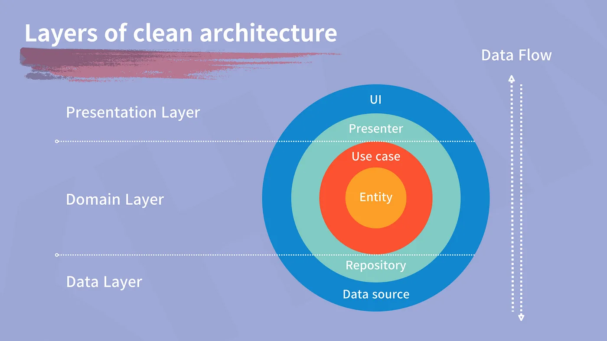

# Andorid CS 정리

## Fragment의 lifecycleOwner로 this, viewLifecycleOwner의 차이
lifecycleOwner는 Fragment의 전반적인 생명주기를 뜻한다. `onAttach ~ onDestroy`까지 포함한다.
viewLifecycleOwner는 프래그먼트 뷰의 생명주기를 가진다. `onCreateView ~ onDestroyView`까지를 포함하낟.
기존의 프래그먼트는 하나의 lifecycle을 가지고 있다. 하지만 프래그먼트는 액티비티와 달리 `onDestroy`가 호출하지 않은 상태에서 `onCreateView`가 여러번 호출 될 수 있다.

만약 `A Fragment`에서 `B Fragment`로 이동할 때 `A Fragment`의 `onDestroyView`는 호출되지만 `onDestroy`는 호출되지 않기에
뷰는 파괴되지만 프래그먼트 자체는 남아있는 상태다. 이런 경우 메모리 누수가 발생할 수 있다.

## sealed Class와 enum의 차이점은?
`sealed Class`는 추상클래스로 해당 클래스 자체는 인스턴스를 가질 수 없다. 상속을 받은 하위 클래스는 자신만의 프로퍼티와 메서드를 가질 수 있기에 더 복잡하고 다양한 상태를 표현할 수 있다.
그리고 컴파일러는 모든 하위 클래스를 알고 있기에 오류를 방지할 수 있다. 
`enum`은 단일 클래스로 컴파일되며, 모든 enum값은 상수 인스턴스로 정의된다. 상수값 외에 별도의 속성이나 복잡한 구조를 정의하기 어렵고, 확장성이 떨어진다.

* `enum`은 간단한 상태, 고정된 상수 집합을 관리할 때 사용하고
* `sealed class`는 복잡한 상태 표현을 할 때 사용하는 것이 좋다.

## dp가 뭔가요?
Density Independent Pixel의 약자로 밀도에 독립적인 픽셀입니다. px 단위로 크기를 설정하면 화면 밀도가 클수록 이미지가 더 작아지게 된다.
이것을 해결하기 위한 것이 dp 단위다.
안드로이드에서는 모든 디바이스의 화면 크기에 관계없이 이미지의 비율을 동일하게 만들고자 dp를 사용한다. dp는 해상도에 독립적이기 때문이다.

## Intent란?
Activity같은 Android Componenet간 소통하는데 사용되는 개념으로 Data와 Action을 명시하여 전달하는 메세징 객체
* 명시적 인텐트 
  * 인탠트에 클래스 객체나 컴포넌트 이름을 지정하여 호출될 대상을 확실히 알 수 있는 경우
* 암시적 인텐트 
  * 호출될 대상의 속성들을 지정했지만 호출될 대상이 달라질 수 있는 경우
[좋은 글](https://medium.com/@wodbs135/%EC%9D%98%EB%8F%84-intent-%EB%A5%BC-%EC%95%8C%EA%B3%A0-%EC%82%AC%EC%9A%A9%ED%95%98%EA%B8%B0-d724e9d938d7)

## PendingIntent란?
내부적으로 intent를 가지고 있는데 이름처럼 당장 수행하지 않고 특정 시점에 수행하도록 하는 특징이 있다.
일반 intent의 경우 다른 앱이 구동되는 상황에서는 내가 정의한 intent를 실행시킬 수 없다.
하지만 PendingIntent를 사용하면 특정 시점에 Intent가 실행하는 것이 보장된다. 어떻게 보장되는 걸까?

다른 프로세스(앱)에게 권한을 허가하여 Intent가 마치 본인 앱에서 실행되는 것처럼 사용하게 된다.
이런 이유로 특정 싲머에 Intent는 무조건 실행될 수 있도록 보장된다.

## Clean Architecture 정리
### 간단한 정의
시스템을 독립적인 계층으로나누어 유지보수성, 확장성, 테스트 용이성을 높이는 방법
### 의존성 방향
Presentation -> Domain <- Data
### 구조 

Presentation = viewModel + View

Domain = entity + usecase + repository

Data = api(network) + repository impl + DB

### UseCase는 왜 사용할까?
만약 useCase를 사용하지 않으면 viewModel에서 repository를 가져와 사용하게 될텐데 그렇게되면 repository가 수정될 때마다 모든 참조하는 곳에서 수정을 해야한다
그런 일을 방지하기 위해서 useCase를 적용한다. useCase는 repository에 의존해서 비지니스 로직을 돌리고 viewModel은 usecase 호출하기에 로직에 대한 수정을 최소화할 수 있다

### 개발하면서 느낀점?
useCase의 사용감이 굉장히 좋았다. 한 기능을 여러군 곳에서 사용할 때 간단하게 적용이 가능하며 로직에 변경이 있을 때도 테스트 및 적용이 간편했다.
다만 어느 시점에서는 오버헤드가 크다고 느끼기도 했다

## Hilt 정리
### 간단 정리
Di 프레임워크 중 하나로 Dagger를 기반으로 빌드되었다.
컴파일 시간 정확성 + 런타임 성능 + 확장성 + 안드로이드 플러그인 지원의 장점이 있다.
### Binds 와 Provides
둘다 공통점으로는 module에서 종속성 주입을 하는데 사용하게 된다.
* Binds
  * 인터페이스와 인터페이스 구현체를 연결하는데 사용한다.
  * module 클래스를 `abstract`로 생성해야한다. 바인드함수도 `abstract`여야 한다.
  * 인터페이스에 대한 객체를 module 내에서 만들지 않고 hilt를 통해 어떤 구현체를 받아 구현할지 결정한다.
* Provides
  * 클래스가 외부 라이브러리에서 제공되어 클래스를 소유하지 않는경우 or 빌더 패턴으로 생성하는 경우 사용
  * 클래스의 인스턴스를 module 내부에서 생성한다.
Provides 방식은 Binds와 달리 자동 생성클래스가 더 만들어진다. 
### 한 객체에 대해 다른 옵션을 가진 인스턴스를 주입하고 싶다면?
`@Qualifier`를 통해 구별해서 사용 가능하다.

## Object, companion object 대해서
### Object
* 싱글톤 패턴을 쉽게 사용하기위한 객체 선언 키워드
* 오브젝트로 생성된 객체는 thread safe 하다
* 객체가 처음으로 사용되는 시점에 생성된다.
* 생성자를 사용할 수는 없다.

### companion object
* 클래스 내부에서 싱글턴 패턴을 구현하기 위한 키워드
* 클래스 당 하나만 생성가능
* 속한 클래스가 load 될 때 생성됨

## HashMap이란?
* hash를 통해 key 값에 연산을하고 해당값을 고유한 key값으로 사용하는 key-value 형식의 컨테이너
* hashing 기업의 특징인 빠른 속도가 장점
* 순서보장 X
### 해시 충돌나는 경우 -> 같은 키값에서 여러 value가 들어오는 경우
기본은 LinkedList로 구현되지만 value가 8개 이상이면 red-black tree로 변경된다
반대로 6개 이하가 되는 경우 다시 LinkedList로 돌아간다
이런 저장 구조가 변경되는 것은 성능 향상이 목적이다
### 해시 충돌 시 전략
* open addressing
  * 규칙에 따라 비어있는 키값에 데이터를 삽입하는 방식
  * 규칙으로는
    * 선형 탐색 -> 몇개 건너뛰어 탐색
    * 제곱 탐색 -> 제곱만큼 건너뛰어 탐색
    * 이중 해시 -> 해시를 한번더 적용해서 나온 곳으로 저장
* separate chaining
  * 위에서 나온 기본적으로 적용되는 방법
### 순서를 보장하고싶다면?
* LinkedHashMap을 사용하면 된다
### HashMap 은 thread-safe하지 않은데 멀티 스레드 환경에서 사용하려면?
* HashTable을 사용하자 HashMap에서 각 함수에 synchronized가 걸려있다
* null 키와 값을 허용하지 않는다 만약 들어온다면 npe가 반겨준다
### 키값을 정렬된 맵을 사용하려면
* TreeMap을 사용하자
* red-black tree로 구성
* 키값을 기본적으로는 숫자 오름차숫, 알파벳 순처럼 왼쪽에는 작은값, 오른쪽에는 큰값이 들어가게된다 
* Comparator 커스텀을 통해 기준을 세워 적용할 수 있다

## Set이란?
* 중복을 허용하지 않는 자료구조
* TreeSet, HashSet, LinkedHashSet 모두 HashMap과 동일한 특성을 가지고 있다 왜냐하면 내부적으로는 TreeMap, HashMap, LinkedHashMap으로 구현되어있다
### setOf, hashSetOf 의 차이점은?
setOf는 불변 set을, hashSetOf는 mutable한 set을 반환해준다
